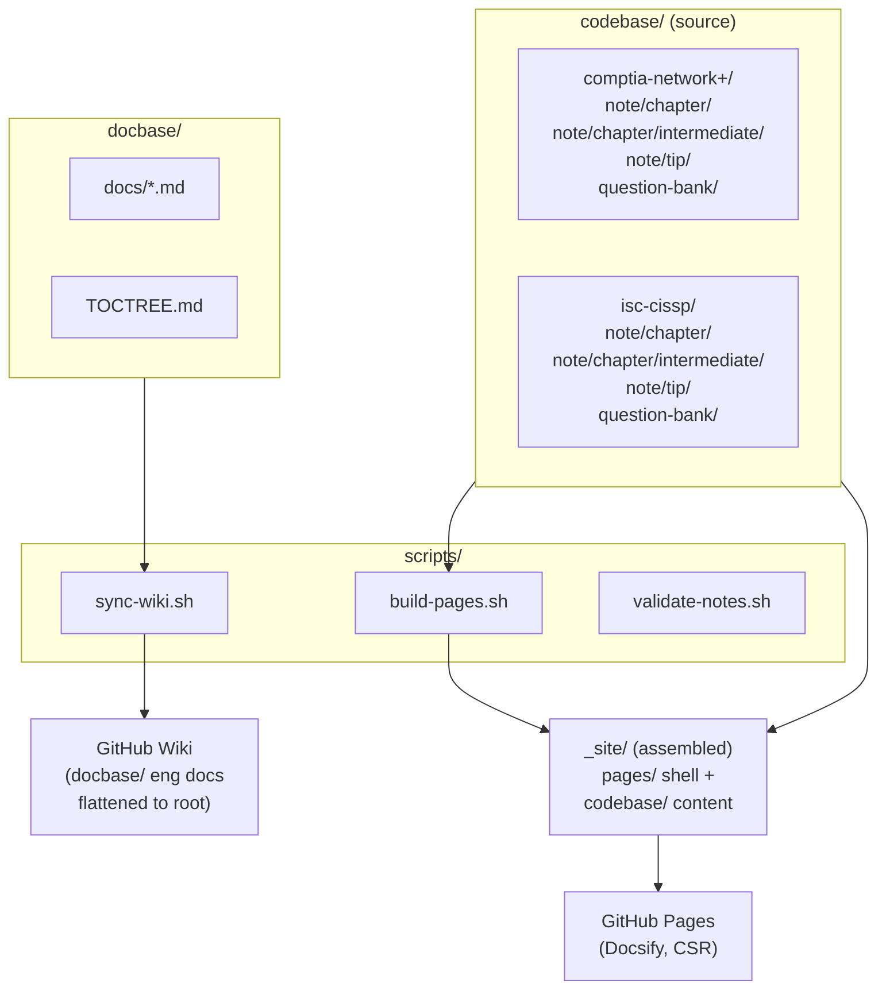

# Architecture

## Overview



## Deployment surfaces

### GitHub Pages (Docsify)

- **No build step** — Docsify renders markdown client-side via JavaScript
- `pages/index.html` loads Docsify + mermaid from CDN
- `pages/README.md` is the TOCTREE landing page (exams → {note, question-bank})
- `pages/_sidebar.md` provides persistent Docsify navigation (auto-generated by `build-pages.sh` with all session links; uses absolute `/`-prefixed paths for `relativePath: true` compatibility)
- `codebase/{exam}/README.md` provides per-exam session tables with clickable links to each session file
- `scripts/build-pages.sh` assembles `_site/` by copying `pages/` shell + `codebase/` content, and auto-generates `_sidebar.md` with all chapter session links
- `.nojekyll` disables Jekyll processing so raw `.md` files are served
- `relativePath: true` in the Docsify config ensures content-relative links work under the Pages subpath
- Search plugin uses `paths: 'all'` to index all sidebar-linked pages (all 62 sessions)

### GitHub Wiki

- `scripts/sync-wiki.sh` publishes `docbase/` engineering docs only (no study notes)
- `Home.md` is generated from the root `README.md` with dead links transformed (codebase/ → Pages URLs, docbase/docs/ → wiki page names, AGENTS.md → GitHub source URL)
- `TOCTREE.md` is generated from `docbase/TOCTREE.md` with links flattened for wiki root and the "Study content" section stripped
- `docbase/docs/*.md` are copied to the wiki root
- `_Sidebar.md` provides navigation (Home, TOCTREE, engineering docs)
- GitHub renders mermaid natively in wiki pages

## Data flow

```
dev-001 push
  → release (CHANGELOG bump)
  → fast_checks (validate-notes.sh)
  → security_checks (Sonar, optional)
  → promote (dev-001 → dev → main)
  → pages + wiki + sonar_baseline (parallel, from main)
```

All jobs chain in a single workflow run. `GITHUB_TOKEN` pushes do not re-trigger the workflow, keeping the pipeline atomic.
